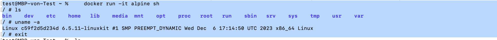
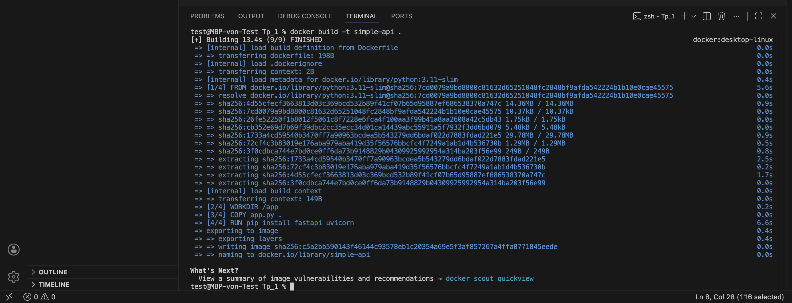
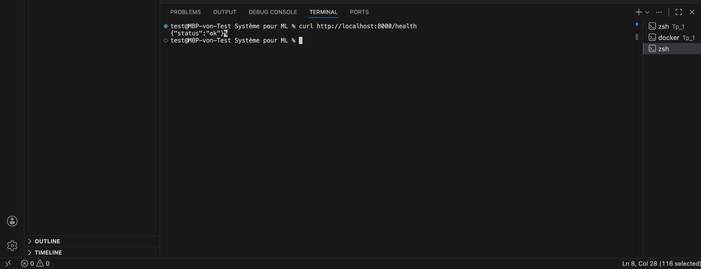
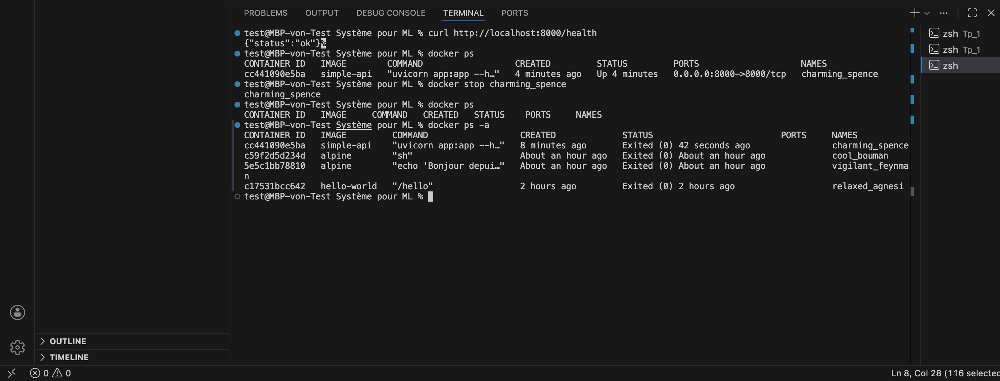
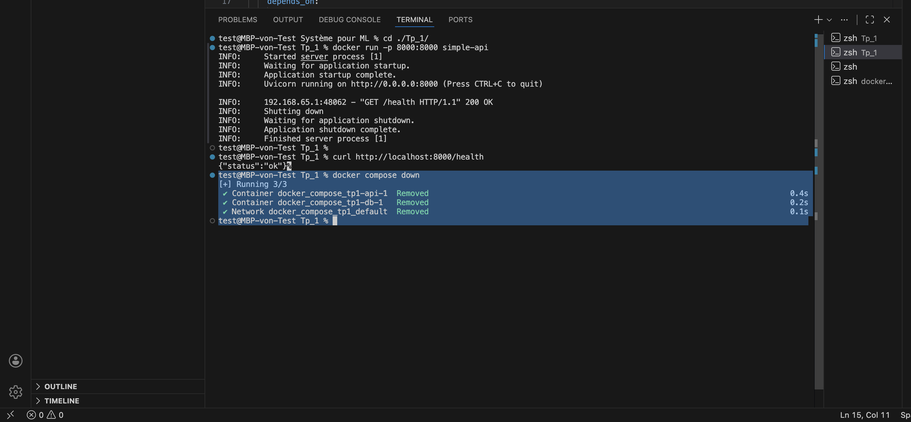
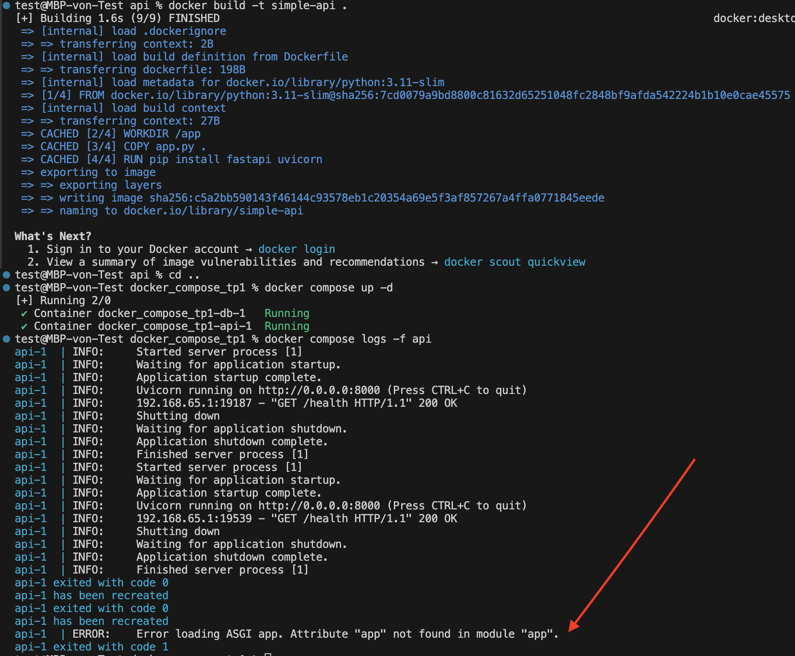

# 📝 Rapport de Travaux Pratiques 1 (TP 1)

## CSC 8613 – Systèmes pour le Machine Learning : Introduction à la Conteneurisation (Docker et Docker Compose)

**Auteur :** Rodrick-Aurell Zegang 

---

## I. Installation de Docker et vérification de l’environnement

### 1. Vérification de l'installation (`docker run hello-world`)

**Résultat de l'exécution :** Le conteneur `hello-world` a été téléchargé, exécuté, et a affiché le message de bienvenue, confirmant que le Moteur Docker est opérationnel sur la machine hôte.

**Capture d’écran : sortie de la commande `docker run hello-world`**

### 2. Liste des conteneurs après exécution (`docker ps -a`)

**Explication de la liste :**  
La commande `docker ps -a` liste tous les conteneurs existants sur la machine, qu'ils soient en cours d'exécution (`Up`) ou arrêtés (`Exited`). L'option `-a` est essentielle pour voir les conteneurs qui ont terminé leur tâche, comme `hello-world`.

---

## II. Premiers pas avec Docker : images et conteneurs

### 1. Différence entre une image Docker et un conteneur Docker

- **Image Docker :** C'est un **modèle figé** (en lecture seule) qui contient le code, les dépendances, le système de fichiers minimal et les configurations nécessaires à l'exécution d'une application. Elle garantit la reproductibilité.  
- **Conteneur Docker :** C'est une **instance active et exécutable** d'une image. Un conteneur possède une couche d'écriture modifiable au-dessus de l'image de base. C'est l'entité qui exécute l'application de manière isolée sur le système hôte.

### 2. Exécution d'un conteneur simple (`docker run alpine`)

Cette capture d'écran montre parfaitement le fonctionnement de base de Docker. On voit que, comme l'image alpine:latest n'était pas sur la machine, Docker l'a automatiquement téléchargée. Une fois le téléchargement terminé (Status: Downloaded newer image), le conteneur a été lancé pour exécuter la commande. Le résultat, "Bonjour depuis un conteneur Alpine", prouve que la tâche a été exécutée avec succès dans l'environnement du conteneur. C'est la preuve que Docker a créé un environnement isolé, même pour une tâche aussi simple.

### 3. Statut du conteneur `alpine` (`docker ps -a`)

Cette capture d'écran, issue de la commande docker ps -a, confirme le cycle de vie typique des conteneurs après exécution d'une tâche unique. On observe que les conteneurs basés sur les images alpine et hello-world sont tous deux en statut Exited (0). Cela signifie qu'une fois la commande qui leur a été assignée (comme echo "Bonjour..." ou /hello) terminée, le processus principal du conteneur s'est achevé, entraînant son arrêt automatique. L'option -a est essentielle car elle permet de voir ces conteneurs arrêtés qui ne sont plus actifs, mais sont toujours présents sur le système.

### 4. Observation d'un conteneur interactif (`docker run -it alpine sh`)

En lançant docker run -it alpine sh, nous avons accédé directement au cœur du conteneur. La commande ls nous a montré que c'est un système Linux très léger. Le point clé est que la commande uname -a prouve que le conteneur partage et utilise le noyau Linux de votre machine, ce qui le rend ultra-rapide et beaucoup plus léger qu'une machine virtuelle.

## III. Construire une première image Docker avec une mini-API FastAPI

### 1. Construction de l'image Docker (`docker build -t simple-api .`)

**Résultat de la commande :** La construction de l'image s'est déroulée en suivant les étapes du Dockerfile (téléchargement de l'image de base, copie du code, installation des dépendances) et l'image a été étiquetée `simple-api`.

## IV. Exécuter l’API FastAPI dans un conteneur Docker

### 1. Lancer le conteneur

Cette capture montre le lancement de notre mini-API FastAPI via la commande docker run -p 8000:8000 simple-api. Le point clé est l'option -p 8000:8000, qui agit comme un pont : elle connecte le port 8000 à l'intérieur du conteneur (où tourne Uvicorn) au port 8000 de votre machine hôte. C'est grâce à ce "pont" que l'API devient accessible depuis votre navigateur ou votre terminal via http://localhost:8000/health. Le message Uvicorn running on http://0.0.0.0:8000 confirme que l'API est démarrée et écoute bien le trafic interne.

### 2. Test de l’endpoint `/health`

Cette capture d'écran montre le test de l'API effectué via la commande curl http://localhost:8000/health. La commande a bien renvoyé la réponse JSON attendue : {"status":"ok"}. Cela confirme que le conteneur de l'API est correctement démarré, que le mappage de port (8000:8000) est fonctionnel, et que l'endpoint de vérification d'état (/health) est bien actif. Le service est donc accessible depuis la machine hôte.

### 3. Observation des conteneurs en cours d’exécution

Cette capture d'écran de la commande docker ps confirme que notre conteneur d'API (simple-api) est lancé et fonctionne correctement, affichant le statut Up 4 minutes. Ce statut valide que l'application est démarrée et stable. De plus, on observe le mappage de port 0.0.0.0:8000->8000/tcp, qui confirme que le trafic destiné au port 8000 de notre machine est bien redirigé vers l'API, la rendant accessible, et le nom du conteneur, ici charming_spence (nom généré aléatoirement), permet son identification pour les opérations d'arrêt ou de débogage.

### 4. Arrêter le conteneur et différence entre `docker ps` et `docker ps -a`

Différence entre docker ps et docker ps -a
-docker ps : Liste uniquement les conteneurs qui sont actuellement en cours d'exécution (statut Up).

-docker ps -a : Liste tous les conteneurs existants sur le système, qu'ils soient en cours d'exécution, arrêtés (Exited), ou simplement créés.

## V. Démarrer un mini-système multi-conteneurs avec Docker Compose

### 1. Fichier `docker-compose.yml` (vous pouvez vous referer au code du fichier )

Le fichier docker-compose.yml joue un rôle central dans notre environnement. Il permet de définir et de lancer deux services essentiels :
	•	db, qui correspond à notre base de données PostgreSQL,
	•	api, qui représente notre API développée avec FastAPI.

Les variables d’environnement (comme POSTGRES_USER, POSTGRES_PASSWORD, etc.) sont configurées avec des valeurs simples afin de rendre la base immédiatement utilisable sans configuration supplémentaire.

Un élément important est la directive depends_on dans le service de l’API. Elle garantit que la base de données est bien démarrée avant que l’API ne tente de s’y connecter, ce qui évite des erreurs au lancement.

Enfin, le mappage des ports (par exemple 8000:8000) permet d’accéder facilement à l’API et à la base de données depuis notre machine locale. Cela facilite grandement le développement et les tests.

### 2. Démarrage et vérification de la stack

Le lancement de notre système multi-conteneurs, grâce à la commande docker compose up -d, est montré sur cette image. Après avoir construit l'image de l'API, Docker Compose a créé un réseau dédié, puis a démarré les deux services en arrière-plan. La commande docker compose ps qui suit confirme le succès : l'API (docker_compose_tp1-api-1) et la base de données (docker_compose_tp1-db-1) sont toutes les deux affichées avec le statut Up 3 minutes, prouvant que notre stack est opérationnelle et que les deux services communiquent correctement.

### 3. Test de l’endpoint `/health` via Compose

La commande a renvoyé `{"status":"ok"}`, confirmant le bon fonctionnement de l'API lancée via Docker Compose.

### 4. Différence entre `docker compose down` et `docker stop <id>`

En regardant cette image et en faisant une comparaison avec la sortie quón avait plus haut avec docker stop <id> nous pouvons dire que : 

- `docker compose down` : arrête et supprime l’ensemble des conteneurs et le réseau associés à la stack Docker Compose.  
- `docker stop <id>` : arrête uniquement un conteneur individuel, qui reste visible dans `docker ps -a` avec le statut `Exited`.

## VI. Interagir avec la base de données PostgreSQL dans un conteneur

### 1. Rôle des options de la connexion PostgreSQL

- `exec` : exécute une commande dans un conteneur en cours d’exécution.  
- `db` : nom du service cible (le conteneur PostgreSQL).  
- `-U demo` : spécifie l’utilisateur PostgreSQL `demo`.  
- `-d demo` : spécifie la base de données `demo`.

### 2. Exécution de commandes SQL

- `SELECT version();` indique la version du serveur PostgreSQL (16.11).  
- `SELECT current_database();` confirme que la base utilisée est `demo`.

### 3. Connexion depuis d'autres services

Un autre service Docker (par exemple l’API) peut se connecter à PostgreSQL avec :

- **hostname :** `db` (nom du service dans Docker Compose).  
- **port :** `5432`.  
- **utilisateur :** `demo`.  
- **mot de passe :** `demo`.  
- **base de données :** `demo`.

### 4. Conséquence de l’option `docker compose down -v`

`docker compose down -v` arrête la stack et supprime également les volumes associés (données persistantes).  
Cela entraîne la **perte définitive des données** contenues dans la base.

## VII. Déboguer des conteneurs Docker : commandes essentielles

### 1. Observation des logs du service `api`

- Au démarrage, les logs montrent le lancement d’Uvicorn et l’initialisation de l’API.  
- Lors d’un appel à `/health`, une ligne de type `GET /health HTTP/1.1" 200 OK` apparaît.

### 2. Entrer dans un conteneur en cours d’exécution

- Le fichier `app.py` est présent dans le répertoire de travail.  
- `python --version` affiche la version de Python (3.11), confirmant l’environnement utilisateur du conteneur.

### 3. Utilité du redémarrage ciblé (`docker compose restart api`)

Cette commande redémarre uniquement le service `api` sans affecter les autres services (comme `db`).  
C’est utile en cas de changement de configuration ou pour récupérer un crash spécifique à l’API.

### 4. Conteneur qui ne démarre pas : diagnostic

Simulation : renommage de `app` en `appi` dans `app.py`, reconstruction, puis relance.

Les logs affichent une erreur du type :  
`ERROR: Error loading ASGI app. Attribute "app" not found in module "app"`.

Cela indique que le serveur Uvicorn ne trouve pas l’objet `app` attendu dans le module `app`, ce qui permet d’identifier rapidement l’origine du problème.

### 5. Utilité du nettoyage régulier de l’environnement Docker

Commandes exécutées :  -docker container prune.         -docker image prune

Le nettoyage régulier permet :

- De récupérer de l’espace disque en supprimant les conteneurs arrêtés et les images non utilisées.  
- De garder un environnement clair, en évitant les versions obsolètes qui peuvent provoquer des confusions.

## VIII. Questions de réflexion finales

### 1. Pourquoi un notebook Jupyter n’est généralement pas adapté pour déployer un modèle de Machine Learning en production ?

Un notebook Jupyter est inadapté pour la production pour plusieurs raisons :

- **Environnement et reproductibilité :** un notebook dépend fortement de l’environnement local (versions de bibliothèques, système, variables, etc.). Docker, via les images, permet d’encapsuler l’ensemble de l’environnement (code, dépendances, configuration) et garantit ainsi une reproductibilité bien meilleure.  
- **Absence de service continu et d’automatisation :** un modèle en production doit être exposé comme un service (souvent via une API HTTP) et tourner de manière fiable (24/7). Un notebook n’est pas conçu comme un processus serveur robuste, contrairement à une API FastAPI exécutée par Uvicorn dans un conteneur Docker lancé avec une commande `CMD`.

### 2. Pourquoi Docker Compose est un outil essentiel lorsque l’on manipule plusieurs services (API, base de données...) ?

Docker Compose est essentiel pour les systèmes distribués car :

- Il permet de **démarrer, arrêter et gérer plusieurs services** (API, base de données, etc.) en une seule commande (`docker compose up`), ce qui simplifie énormément le développement et les tests.  
- Il gère automatiquement la **mise en réseau** entre services : un service peut joindre un autre via son nom de service (par exemple `db`), ce qui évite la gestion manuelle des adresses IP et rend la configuration plus simple et portable.

---

## Conclusion

Ce TP a permis de mettre en place un environnement complet basé sur Docker et Docker Compose pour une mini-API FastAPI et une base PostgreSQL. Les notions abordées (images, conteneurs, mappage de ports, logs, Docker Compose, interactions avec une base de données) constituent la base nécessaire pour déployer et maintenir des systèmes de Machine Learning en production.

 
