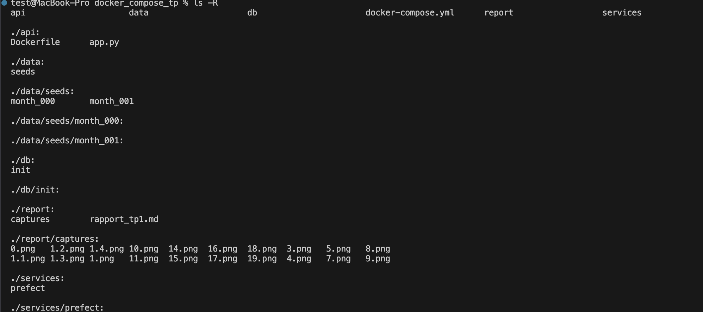

# Rapport TP2 - Ingestion mensuelle, validation et snapshots

## État initial du dépôt
 Au début du tp , tout est ok et à jours , nous pouvons debuter le travail

## Structure du projet et des données
L'arborescence du projet a été mise à jour pour accueillir les nouveaux composants du pipeline MLOps (base de données, données brutes et orchestrateur).

### Contenu des dossiers de données
Les données sources ont été extraites dans les répertoires correspondants :
- **Month 000** : Contient les fichiers initiaux pour l'entraînement.
- **Month 001** : Contient les mises à jour et les nouveaux utilisateurs pour tester l'ingestion incrémentale.

### Configuration de l'environnement
Un fichier `.env` a été créé à la racine du projet pour centraliser les paramètres de connexion à la base de données PostgreSQL. L'utilisation de variables d'environnement permet de séparer la configuration sensible du code d'infrastructure (Docker Compose) et des scripts d'orchestration (Prefect).

## Mise à jour de l'orchestration (Docker Compose)
Le fichier `docker-compose.yml` a été mis à jour pour définir deux services :
- **postgres** : Utilise l'image PostgreSQL 16. Le dossier `./db/init` est monté dans `/docker-entrypoint-initdb.d` pour que le schéma SQL soit chargé au démarrage. Les données sont persistées via le volume nommé `pgdata`.
- **prefect** : Ce service sera construit à partir d'un Dockerfile personnalisé[cite: 1631]. Il accède aux données brutes via un montage en lecture seule (`:ro`) du dossier `./data`.

## Vérification de l'initialisation de la base de données
Après le démarrage du service `postgres`, la commande `\dt` confirme que toutes les tables ont été créées avec succès :

**Sortie de la commande \dt :**

**Description des tables :**
- **users** : Contient les informations de profil de base des clients (genre, ancienneté, situation familiale).
- **subscriptions** : Détaille les types de contrats, les options de streaming et les frais mensuels.
- **usage_agg_30d** : Métriques d'utilisation sur 30 jours (heures de visionnage, sessions, appareils).
- **payments_agg_90d** : Historique des incidents de paiement sur les 90 derniers jours.
- **support_agg_90d** : Statistiques sur les interactions avec le support client.
- **labels** : Stocke la cible à prédire (le churn).

## Mise en place de l'orchestrateur Prefect

Un service dédié à l'orchestration a été créé dans le répertoire `services/prefect/`. Ce service utilise une image de base `prefecthq/prefect` sur laquelle sont installées les dépendances nécessaires au pipeline (Pandas, SQLAlchemy, Great Expectations, etc.).

Le rôle de ce conteneur est de piloter le pipeline d'ingestion, de gérer les logs d'exécution et d'assurer la reprise en cas d'échec des tâches.

## Logique d'ingestion et d'Upsert
Le script `ingest_flow.py` utilise une stratégie d'**Upsert** (Update ou Insert) pour garantir l'idempotence du pipeline. 

**Logique de la fonction `upsert_csv` :**
1. Le fichier CSV est chargé dans un DataFrame Pandas et les types (dates et booléens) sont normalisés.
2. Une table temporaire est créée dans PostgreSQL pour accueillir les données brutes.
3. Une requête SQL `INSERT ... ON CONFLICT DO UPDATE` est exécutée. Elle insère les nouvelles lignes ou met à jour les lignes existantes si le `user_id` est déjà présent.
4. Cette méthode permet de relancer le pipeline plusieurs fois sans créer de doublons et en s'assurant que les données les plus récentes sont à jour.

## Ingestion du mois 000 (Janvier 2024)
L'ingestion des données initiales a été réalisée avec succès via l'orchestrateur Prefect. 

**Statistiques après ingestion :**
- **Nombre d'utilisateurs (table users) :** 7043
- **Nombre d'abonnements (table subscriptions) :** 7043

L'utilisation de la logique d'Upsert garantit que si nous relançons cette commande, le nombre de lignes restera identique, évitant ainsi toute duplication de données dans notre système de production.

## Validation des données avec Great Expectations

### Description de la solution
L'étape de validation a été implémentée via la tâche `validate_with_ge`. Elle utilise la bibliothèque Great Expectations pour effectuer des tests sur les DataFrames extraits de PostgreSQL après l'ingestion.

**Le rôle de cette étape dans le pipeline est :**
* **Vérification de l'intégrité** : S'assurer que les colonnes obligatoires (comme `user_id`) ne contiennent pas de valeurs nulles.
* **Validation métier** : Vérifier que les métriques (comme `watch_hours_30d`) respectent des bornes logiques (valeurs positives).
* **Sécurisation du flux** : En cas d'échec de validation, le flow Prefect est interrompu par une `AssertionError`, empêchant ainsi l'utilisation de données corrompues pour les étapes suivantes (snapshots et entraînement).

## Gestion des Snapshots et isolation temporelle

### Description de la solution
La stratégie de snapshot implémentée suit la recommandation du cours en utilisant des tables historisées (suffixées par `_snapshots`) situées dans le schéma `public`. Chaque table utilise une clé primaire composite `(user_id, as_of)`, permettant de stocker plusieurs versions temporelles pour un même utilisateur sans collision.

**Rôle de snapshot_month dans le pipeline:**

* **Versioning des données** : Alors que les tables de production sont mises à jour par "Upsert", les tables de snapshots archivent l'état immuable des données à la date `as_of`.
* **Entraînement Point-in-Time** : Cette structure permet d'extraire les caractéristiques exactes d'un utilisateur au moment où une étiquette (label) a été générée, empêchant ainsi le **Data Leakage** (fuite de données futures dans le passé).
* **Idempotence technique** : L'utilisation de la clause `ON CONFLICT (user_id, as_of) DO NOTHING` garantit qu'une réexécution du pipeline pour une même date n'altère pas les données déjà archivées.

### Preuve d'exécution
L'exécution de la commande `\dt` dans PostgreSQL confirme la création des tables de snapshots, et la consultation des premières lignes montre le bon marquage temporel des données.

## Ingestion du mois 001 et validation de l'idempotence

### Description de la solution
L'ingestion des données du mois de février (`month_001`) a permis de valider le comportement dynamique et robuste du pipeline MLOps. Le système a correctement traité les mises à jour tout en préservant l'intégrité de l'historique.

**Résultats observés :**

* **Idempotence et Mise à jour** : La table de production a été mise à jour via la logique d'Upsert sans duplication d'utilisateurs.
* **Validation de l'historisation (Point-in-Time)** : Les tables de snapshots contiennent désormais les deux versions temporelles (`2024-01-31` et `2024-02-29`) pour chaque utilisateur, respectant la structure de clé primaire composite `(user_id, as_of)`.
* **Continuité de la qualité** : Le passage réussi des tests Great Expectations sur ce second mois confirme la fiabilité des contrôles implémentés.

## Conclusion
Le TP2 a permis de mettre en place un pipeline d'ingestion robuste et industrialisé. Grâce à l'utilisation combinée de Docker, Prefect et Great Expectations, les données sont non seulement chargées de manière idempotente, mais aussi validées et historisées. Cette architecture constitue une base solide pour l'alimentation d'un Feature Store et l'entraînement de modèles de Machine Learning reproductibles.