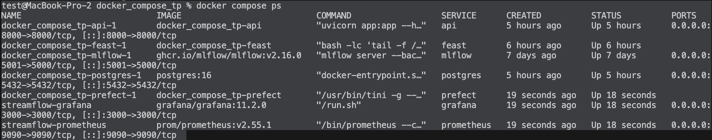
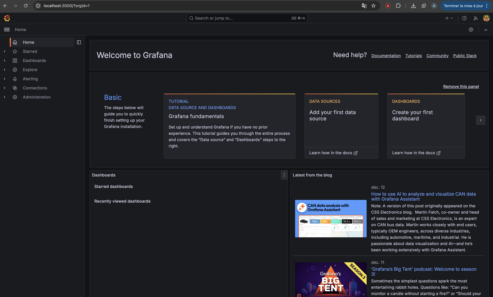
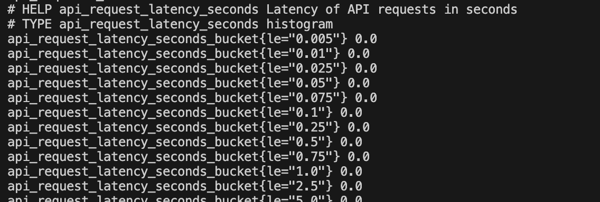
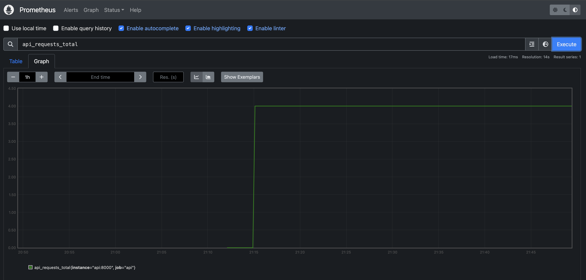
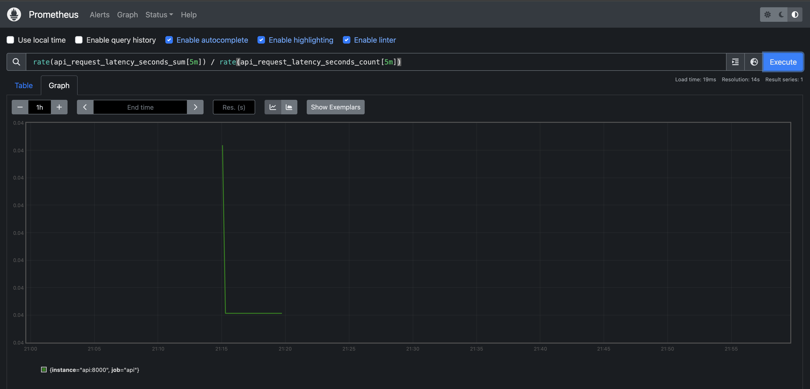
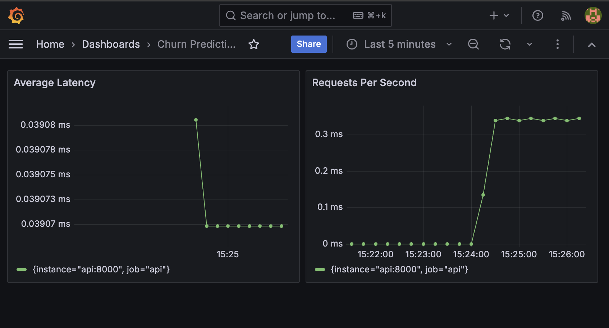
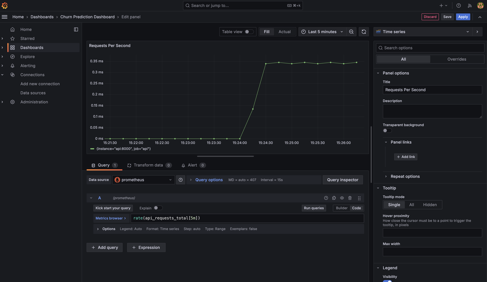
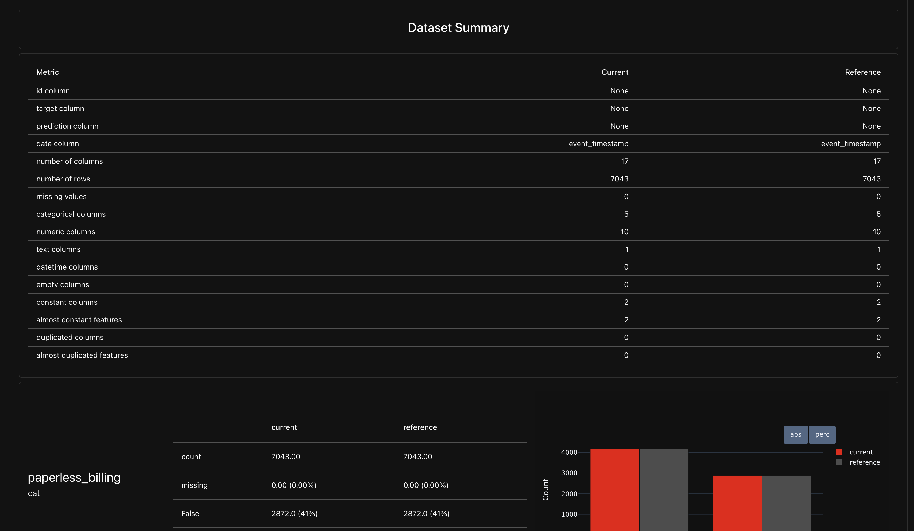
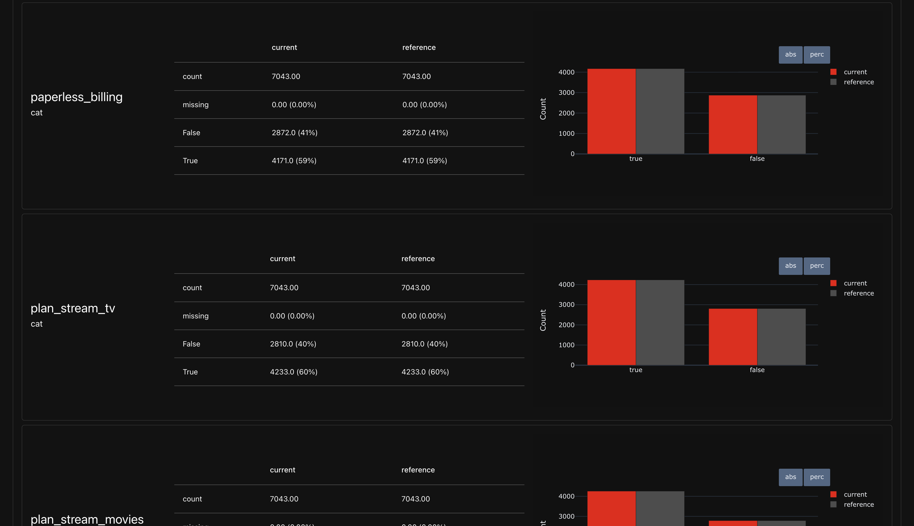

# Rapport TP5 - Monitoring et Observabilité

## Démarrage de la stack d'observabilité

### État des services
Tous les conteneurs sont démarrés et fonctionnels :


**Liste des conteneurs actifs :**
- `docker_compose_tp-api-1` : Service FastAPI exposant l'endpoint de prédiction
- `docker_compose_tp-feast-1` : Feature Store pour la gestion des features
- `docker_compose_tp-mlflow-1` : Tracking server et Model Registry
- `docker_compose_tp-postgres-1` : Base de données PostgreSQL
- `docker_compose_tp-prefect-1` : Orchestrateur de workflows
- `streamflow-grafana` : Interface de visualisation des métriques
- `streamflow-prometheus` : Collecteur et stockage de métriques

### Accès aux interfaces :
- **Prometheus : http://localhost:9090** 


- **Grafana : http://localhost:3000** 


### Réseau Docker et résolution de noms
Prometheus utilise `api:8000` au lieu de `localhost:8000` car tous les conteneurs partagent le même réseau Docker (défini dans docker-compose.yml), ce qui permet la résolution DNS automatique des noms de services - `api` est ainsi résolu vers l'adresse IP interne du conteneur de l'API, alors que `localhost` ferait référence au conteneur Prometheus lui-même.


## Instrumentation de FastAPI avec de métriques Prometheus

### Implémentation des métriques
Les métriques suivantes ont été ajoutées dans `api/app.py` :
- **Counter** `api_requests_total` : compte le nombre total de requêtes reçues
- **Histogram** `api_request_latency_seconds` : mesure la distribution des latences

### Vérification de l'endpoint /metrics

**État initial (aucune requête) :**
```
# HELP api_requests_total Total number of API requests
# TYPE api_requests_total counter
api_requests_total 0.0

# HELP api_request_latency_seconds Latency of API requests in seconds
# TYPE api_request_latency_seconds histogram
api_request_latency_seconds_bucket{le="0.005"} 0.0
api_request_latency_seconds_bucket{le="0.01"} 0.0
api_request_latency_seconds_bucket{le="0.025"} 0.0
api_request_latency_seconds_bucket{le="0.05"} 0.0
...
api_request_latency_seconds_count 0.0
api_request_latency_seconds_sum 0.0
```




**Après 4 requêtes de prédiction :**
```
# HELP api_requests_total Total number of API requests
# TYPE api_requests_total counter
api_requests_total 4.0

# HELP api_request_latency_seconds Latency of API requests in seconds
# TYPE api_request_latency_seconds histogram
api_request_latency_seconds_bucket{le="0.005"} 0.0
api_request_latency_seconds_bucket{le="0.01"} 0.0
api_request_latency_seconds_bucket{le="0.025"} 0.0
api_request_latency_seconds_bucket{le="0.05"} 4.0
api_request_latency_seconds_bucket{le="0.075"} 4.0
...
api_request_latency_seconds_count 4.0
api_request_latency_seconds_sum 0.152130126953125
```


### Pourquoi l'histogramme est plus utile qu'une simple moyenne

Un histogramme capture la **distribution complète des latences** via des buckets prédéfinis, permettant de calculer les percentiles (p50, p95, p99) essentiels pour détecter les requêtes anormalement lentes (tail latency). Une simple moyenne masque ces cas extrêmes : par exemple, 99 requêtes à 10ms et 1 requête à 5000ms donnent une moyenne de ~60ms, ce qui ne reflète pas la mauvaise expérience d'1% des utilisateurs. L'histogramme révèle que le p99 est de 5000ms, permettant d'identifier et de corriger le problème. De plus, l'histogramme stocke les données de manière agrégeable et peut être utilisé pour calculer des métriques à différents intervalles de temps sans perdre d'information.

## Exploration de Prometheus

### Validation du Scraping
L'interface Prometheus confirme que la target `api` est opérationnelle :


* **up == 1** : La valeur passe de 0 à 1 à 21h12, marquant l'instant où l'endpoint /metrics est devenu accessible. Le maintien à 1 prouve que le cycle de scraping est stable


* **api_requests_total == 4** : Le graphique affiche une "marche d'escalier" à 21h15. Ce saut de 0 à 4 valide que chaque appel à /predict incrémente bien le Counter de manière persistante.



* **Analyse_du_trafic**
Pour la requête `rate(api_requests_total[5m])` On observe un pic (créneau) qui traduit la densité des requêtes manuelles sur une fenêtre de 5 minutes. Le retour immédiat à 0 après 21h20 confirme qu'aucun trafic résiduel ou automatique n'impacte l'API.


Le ratio sum / count reste sous la barre des 0.05s, indiquant que l'inférence (Feast + MLflow) est performante et que la majorité des requêtes tombent dans les premiers buckets de l'histogramme. 




## Analyse de l'observabilité technique (Exercice 4.e)

### Dashboard "Churn Prediction" - Corrélation Infrastructure
Le dashboard "Churn Prediction" montre une corrélation parfaite entre les deux panels lors de la phase de test :







#### Ce que ces métriques détectent bien :

**Le débit (RPS) :** On voit très nettement le pic d'activité vers 15h24, où le système passe de 0 à environ 0.35 requêtes par seconde. Cela permet de surveiller la charge réelle supportée par l'API et d'anticiper les besoins en scaling horizontal.

**La performance (Latence) :** Le panel "Average Latency" indique une stabilisation immédiate autour de 0.039 ms (soit environ 39 microsecondes). Cela confirme que l'infrastructure (API + Feature Store Feast) répond de manière extrêmement rapide et constante, sans dégradation sous la charge.

**La stabilité technique :** L'absence de pics de latence pendant le pic de trafic prouve que le système est bien dimensionné pour ce volume. Les ressources CPU/mémoire ne sont pas saturées et le pipeline d'inférence (récupération features + prédiction) est optimisé.

#### Ce qu'elles ne permettent **pas** de détecter :

**La qualité du modèle :** Bien que les courbes soient stables et rapides, elles ne disent rien sur la justesse des prédictions de churn. Un modèle qui prédit systématiquement "0" afficherait les mêmes performances techniques tout en étant complètement inutile.

**La dérive fonctionnelle (Drift) :** Si les caractéristiques des clients changent (par exemple, si les nouveaux clients ont des comportements d'utilisation très différents de ceux utilisés pour l'entraînement), le dashboard restera "au vert" (rapide et disponible) alors que le modèle perdra toute sa valeur prédictive. Ce type de dégradation silencieuse nécessite un monitoring ML spécifique (distribution des features, performance métier, etc.).

**Les erreurs métier :** Une prédiction erronée mais techniquement valide (code HTTP 200, latence normale) ne sera jamais remontée par ces métriques purement techniques.

### Conclusion
L'observabilité infrastructure (Prometheus/Grafana) est **nécessaire mais non suffisante** pour garantir la qualité d'un système ML en production. Elle doit être complétée par un monitoring métier (accuracy, precision, recall) et un suivi de la distribution des données (data drift detection).   


## Analyse du Monitoring (Question 5b & 5c)

### 1. Rapport Evidently (Comparaison Janvier vs Février)
Le rapport généré compare les données de référence (Janvier) aux données actuelles (Février). 




### 2. Covariate Drift vs Target Drift
Dans ce projet, il est important de distinguer :
* **Covariate Drift :** Dérive des variables d'entrée (ex: `watch_hours_30d`). Cela indique que le comportement des utilisateurs change.
* **Target Drift :** Dérive de la variable cible (`churn_label`). Cela indique que le taux global de désabonnement change, ce qui impacterait directement la fiabilité des prédictions du modèle.

### 3. Décision finale du script
Voici la ligne de décision extraite de mes logs d'exécution :

```
[Evidently] report_html=/reports/evidently/drift_2024-01-31_vs_2024-02-29.html report_json=/reports/evidently/drift_2024-01-31_vs_2024-02-29.json drift_share=0.06 -> NO_ACTION drift_share=0.06 < 0.30 (target_drift=0.0)
```