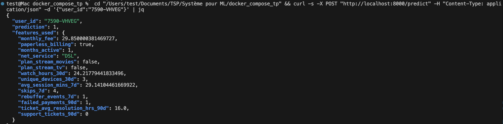
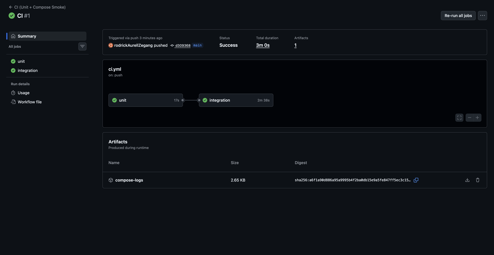

# Rapport TP6

## EXERCICE1

Avant de commencer ce TP, redemarons la stack et vérifier que les services principaux sont Up.


Nous vérfions aussi que nous avons bien un modèle en production en nous rendant sur MlFlow (http://localhost:5001)


## Exercice 2


Les 2 tests créés sont bien passés. On a extrait une fonction pure pour les tests unitaires puisqu'elle est déterministe ce qui permet de la tester de manière rapide et isolée.

## Exercice 3 - Train & Compare

### Logs du flow
```
[COMPARE] candidate_auc=0.6328 vs prod_auc=0.9035 (delta=0.0100)
[SUMMARY] as_of=2024-02-29 cand_v=6 cand_auc=0.6328 prod_v=3 prod_auc=0.9035 -> skipped
```

### Capture MLflow


### Pourquoi utiliser un delta
Le delta impose une marge minimale d’amélioration avant promotion, pour éviter de promouvoir un modèle sur une variation due au bruit ou à l’aléa d’entraînement.

## Exercice 4
Exécutez le monitoring (référence month_000 vs current month_001) avec un seuil à 0.02. docker compose exec prefect python monitor_flow.py

on voit dans les logs que drift_share=0.06 >= 0.02 donc ça déclenche un réentrainement.
Le nouveau modèle est ensuite évalué, mais il n’est pas promu car il a de moins bonnes performances AUC que le modèle en production (ex. should_promote(new_auc = 0.6328, prod_auc=0.9035, delta=0.01) → faux). Cela montre que même en présence de drift, le modèle actuel reste plus performant.


Une capture (ou extrait) du rapport Evidently HTML (fichier reports/evidently/drift_*.html)


## Exercice 5



L’API doit être redémarrée parce qu’elle garde en mémoire des connexions et une configuration de Feast/MLflow au démarrage. Après un feast apply/materialize, les tables online changent, mais l’API continue d’utiliser l’ancien état (ou des connexions déjà ouvertes). Le redémarrage force le rechargement de la config et l’accès aux nouvelles tables/features, évitant les erreurs “relation … does not exist”.

## Exercice 6


 
 On démarre Docker Compose en CI pour exécuter des tests d’intégration multi‑services et vérifier que tous les composants communiquent correctement dans un environnement proche de la production

 ## Exercice 7 

### Synthèse
Le système met en place une boucle MLOps complète : détection de drift, déclenchement du réentraînement, évaluation comparative et décision de promotion. Le drift est mesuré avec Evidently en comparant les distributions des features entre month_000 et month_001. La métrique `drift_share` est comparée à un seuil fixé à 0.02 pour le TP ; en production, ce seuil serait ajusté à partir de l’historique  afin de limiter les réentraînements inutiles.

Quand un drift dépasse le seuil, le flow `train_and_compare_flow` entraîne un candidat, calcule ses métriques (dont `val_auc`) sur un split de validation et les compare au modèle en production. La promotion est décidée par `should_promote()` : le candidat n’est promu que si son AUC dépasse celle de la production d’au moins `delta`. Cela évite de remplacer le modèle actuel pour des gains marginaux ou bruités.

Prefect orchestre la partie ML (monitoring, entraînement, comparaison, promotion) et gère l’exécution des tâches et leurs dépendances. GitHub Actions assure l’intégration continue du code (tests et vérifications), en particulier via Docker Compose pour valider l’interconnexion des services. Cette séparation garantit une CI rapide et fiable, tout en laissant à Prefect les workflows lourds.

### Limites / améliorations
La CI ne doit pas entraîner un modèle complet : c’est coûteux, long et non déterministe (dépendant des données). Les tests CI doivent rester rapides et reproductibles. Des tests manquent encore : performance (latence, throughput), robustesse aux données manquantes/aberrantes, intégration bout‑en‑bout, et suivi du concept drift.

En production, une validation humaine ou un processus de gouvernance est souvent nécessaire avant la promotion (revue data, tests en staging, exigences réglementaires). Une amélioration serait d’ajouter un stage « Staging » dans MLflow, avec validations automatiques et approbation manuelle avant passage en Production.